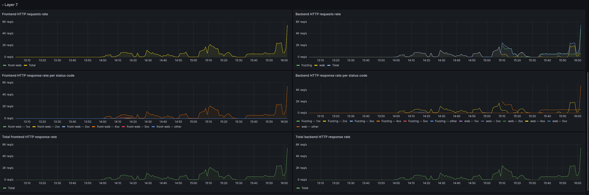

# Flag4All 2023 - RETEX Infra


Pensez toujours quand vous montez une infra à quoi elle doit répondre et surtout qui va l'opérer et avec quelles compétences.
Parce que vous allez vouloir dormir ou partir en vacances en restant au calme.

## Presentation

### cahier des charges: 

* Aucune idée du nombre de joueurs: 100 à 1000
* Ne doit pas se faire Pwn
* DoS et DDoS peuvent arriver.
* Minimiser les risques de downtime.
* Simple à maintenir, l'équipe admin en rotation sur 24h
* Ne pas dépasser la limite budgétaire.
* Les challenges dans du container.

### Equipe Infra
Je ne parle pas des contributeurs mais des intervenants majeurs.
Tous chez BZHack et les partenaires ont contribué d'une manière ou d'une autre.
#### Hosting
* Azgarech
* Penthium2
* Sanguine
* Tete2Soja

#### CTFD
* 0xiloudoudou
* Penthium 2
* K-lfa


## Choix technologique

### Docker Swarm

Docker ou Kubernetes ? Le choix est fait ça sera [DockerSwarm](https://docs.docker.com/engine/swarm/), un entre-deux.

Swarm est un outil d'orchestration directement intégré à Docker depuis la version 1.12. 
Il est facile à utiliser par rapport à Kubernetes et plus facile à maintenir pour une petite équipe qui a des bases en docker.
* Hautement disponible (peut tolérer un certains nombres de défaillance)
* Évolutif (peut ajouter des ressources ou des capacités en fonction des besoins)
* Portable (exécutez-le chez vous aujourd'hui, exécutez-le partout demain)
* Automatisé (nécessite un minimum d'entretien et d'alimentation)

### Ceph

Bien que Docker Swarm soit excellent pour maintenir les conteneurs en fonctionnement et fournir des capacités de mise à l'échelle, il manque l'intégration directe d'un stockage persistant entre les nœuds. 
Dans certains cas, on a aussi besoin de facilement partager les données entre les nodes (fichiers compose, scripts, etc.). Sait on jamais, un des noeuds pourrait tomber!

Les challenges n'ont pas besoin de persistance (vaut mieux éviter :p ) . Mais c'est plus compliqué pour CTFD qui a besoin de sa base de données et pour le coup ça serait dommage de reset à chaque redémarrage. 

C'est pourquoi nous avons également mis en place un cluster Ceph.


[Ceph](https://ceph.io) est une plateforme de stockage logicielle (software-defined storage) Open Source.
Il met en œuvre le stockage d'objets sur une seule grappe d'ordinateurs distribués et fournit des interfaces 3-en-1 pour le stockage au niveau des objets, des blocs et des fichiers. 
Ceph vise principalement un fonctionnement entièrement distribué sans point de défaillance unique, évolutif jusqu'au niveau de l'exaoctet.

Il existe de nombreuses autres solution que Ceph (et sûrement plus légère). Mais j'ai de l'expérience avec (ainsi que d'autres BZHack) et surtout avec la restauration de service quand les choses partes de travers.

### Répartiteur de charge et routing/network meshing.

Initialement la partie load balancer devait être supporté uniquement par [Traefik](https://doc.traefik.io/traefik/) mais il a été décidé (un peu sur un coup de tête) de mettre en place le loadbalancer de Scaleway (jeudi soir vers 23h).
Cela a été une très bonne idée au vu de la charge qui a été observée lors de l'événement.

Initialement, les redirections web devaient être portées par traefik et les TCP par le LB Scaleway. Dans les faits nous l'avons fait de manière hybride.

### Bucket

Nous avons également utilisé un bucket S3 pour les besoins de déploiements mais aussi pour du backup de données en dehors des Hôtes.

### Hébergement

Nous avons choisis Scaleway pour l'hébergement (aucun partenariat en cours). Ils ont toute une gamme intéressante de services dans des prix contenus, et surtout, une API très complète et bien documentée.
Sans parler de leur provider Terraform, qui est lui aussi complet et documenté.

### Supervision et Métriques

Nous avons utilisé la solution Cockpit de Scaleway. (Graphana, Loki, ...)

### Infrastructure As Code

BZHack organise des CTF pour les écoles, les entreprises, et pour le plaisir de tous. Nous avons donc régulièrement besoin de monter des infrastructures.
Etant une association de volontaires, nous pouvons difficilement passer des temps infinis à déployer des environnements.
C'est pourquoi nous avons commencé à créer des template, pour simplifier la mise en place des événements. 
L'avantage de l'IAC, c'est qu'il est aussi simple de construire et de détruire les environnements ( attention à ne pas glisser en prod). 

Le cloud est merveilleux mais peu coûter cher. 
Pouvoir s'assurer de décommissioner ce qui a été monté est indispensable si on ne veut pas mettre l'association dans le rouge.

De plus, cette flexibilité permet de faire des environnements de preprod sous dimensionnés pour les tests et de passer à l'infrastructure cible en changeant une valeur de variable.
(réduction des coûts et gestion de charge plus simple)

Il existe de nombreuses solutions pour faire de l'IAC: Ansible, Pulumi, Terraform. 

Ayant plus d'expérience avec Terraform et appréciant ça gestion des états, c'est sur cette solution que nous nous sommes appuyé pour déployer les environnements.

### CTFD

Le provisionnement du CTFD en challenge se faisait au travers un fork de ctfd-cli le 0xiloudoudou.
Tous les éléments étaient présents sur un git et nous n'avions qu'à les pousser une fois les modifications faites sur le github.

## Architecture


## Ce qui a mal tournée. Les coulisses

D'une manière générale, l'infra et le CTD s'est plutôt bien passé.

Mais certaines choses se sont passées.

### Error 503

Il y a eu plusieurs erreur 503.

#### Sous-dimensionnement Loadbalancer 

Au début de l'événement, après une bonne heure de jeu un charmant modérateur a indiqué à des joueurs que le fuzzing était autorisé sur un challenge (dans les faits, 3 challenges était fuzzing bombs).
Traefik, n'était pas capable de suivre la charge et le premier crash est arrivé. Pas du CTFD mais d'un composant. 

De plus la limite de Bande passante du Load balanceur scaleway était proche du sous-dimenssionnement, nous avons donc changer le modèle pour un plus important (opération sans coupûre).

Premier gros pic de requêtes concurrentes et de Bande Passante: 8.6k req/s, Traffic à 0.8 Gib/s

Une fois ça fait, nous avons créés des backends et frontends spécifiques pour les challenges autorisant le fuzzing et nous avons configurer des routes pour rediriger directement sur les containers sans passer par traefik.

Temps de résolution: moins d'une minute, temps d'indisponibilité: 2 minutes.

Apprentissage: Nous mettrons directement en place un loadbalancer en amont de l'infra, avec du routage avancé, nous abandonnerons peut être traefik car plus nécessaire.

#### Crash CTFD

Dimanche matin(9h55 et 10h27), nous avons eu deux crash, le premier, CTFD est partie dans des erreurs et à simplement crashé (erreur dans la console). 

Le healtcheck en place retournait pourtant du status 200 ok et le service ne s'est pas redéployé correctement.

Sur le second cas, c'était Traefik qui commençait à souffrir des tentatives sur un certains challenges web pas dans la liste des fuzzables. (redémarrage du service + ajout dans le lb frontal).

Temps de résolutions combinés 2 minutes, indisponibilité 3 minutes.

Apprentissage : Améliorer le clustering CTFD ou passer sur un autre framework.


### Exercice PCA / PRA Live

2h25 - Toute l'infra est Down.


Le pire, c'est que cette incident majeure sur l'infrastructure était délibérée . Présentation de ce que l'on appellera dorénavant "l'événement INIT 6". 

L'infrastructure tenait plutôt bien la charge est nous avons commencé à avoir une discussion avec Penthium2, Sanguine et les autres sur "ça tient, mais est-ce que c'est vraiment résiliant".

Ma réponse a été de dire: "Tant qu'un nœud ne tombe pas, pas vraiment possible dans être sûr, théoriquement on est bon!"

Penthium2 s'est donc connecté sur le nœuds avec le plus de service critique et à tapé la commande ``` init 6``` .

Un petit " Sanguine, appuie sur Enter!" a fait le reste.

Quelques meme pour illustrer:


Le serveur avec la base de donnée active, traefik, les services d'administration était en train de redémarrer. Ce que nous savions pas encore, c'est que certains ont lancé un paquet d'outils sur gishadb.
En même temps que nous faisions notre exercice, nous nous retrouvions avec le plus gros pic de charge: 2,7 Gib/s sur le challenge gishadb

Les 2 nœuds encore actifs en plus de devoir remonter les services tombés, devait gérer un afflux à la limite de leur capacité réseau. CPU: usage 700% et RAM à 70% (sur chacun, 8 CPU - 32 Go de RAM).

Les services sont remontés un peu plus lentement que prévus, aucune intervention des administrateurs si ce n'est controller les états / étapes.

Temps d'indisponibilité 8 minutes, joueurs impactés: 10

Je me suis rendu compte également d'une bêtise sur le healthcheck web global du loadbalancer, il était porté sur CTFD. 
De nombreux challenges n'étais plus disponibles et pourtant up car le LB considérait le backend down, le trafic n'était plus relayé, seuls les TCP fonctionnaient encore.

Apprentissage: 
* On a bien rit côté orga et ça a réveillé certains participants (une fois la frustration passée :p).
* Cela a donné lieu à de nombreux memes.
* La prochaine fois, reboot un serveur de prod n'occasionnera aucun downtime ou presque.
* Les PCA/PRA sont importants et rien de tel qu'un exercise grandeur nature pour les valider.
* Nous allons peut être organiser d'autres événements du genre. Un peu comme les jeux de foire de la cible et de la piscine.


### SLA totale

La plateforme a été indisponible 13 minutes sur les 24 heures de la compétition. 
(ne prend pas en compte la correction de certains challenges).

((24*60)-13)/(24*60) = 99.09%


### Quel projet pour le futur

* Du code Terraform compatible multiple fournisseur (SCALEWAY, OVH, etc.)
* Supprimer les quelques actions encore manuelle du déploiement.
* Rendre le code OpenSource pour en faire profiter les écoles et autres associations.
* atteindre un SLA de 99,99% - 1m 26s d'indispo sur 24h.
* Améliorer encore la qualité des challenges fournis pour ne pas avoir à les améliorer/réparer dans leur contenu (uniquement description ou tips si besoin).


### Quelques images:  

J'ai ri (credit: NozZy)


Le Fuzzing c'est rigolo


Quand ça va manger ou dormir


ça grimpe là! Non ?




##### END

Merci à tous (Orga, partenaires, joueurs) pour ce super temps !

Azgarech
