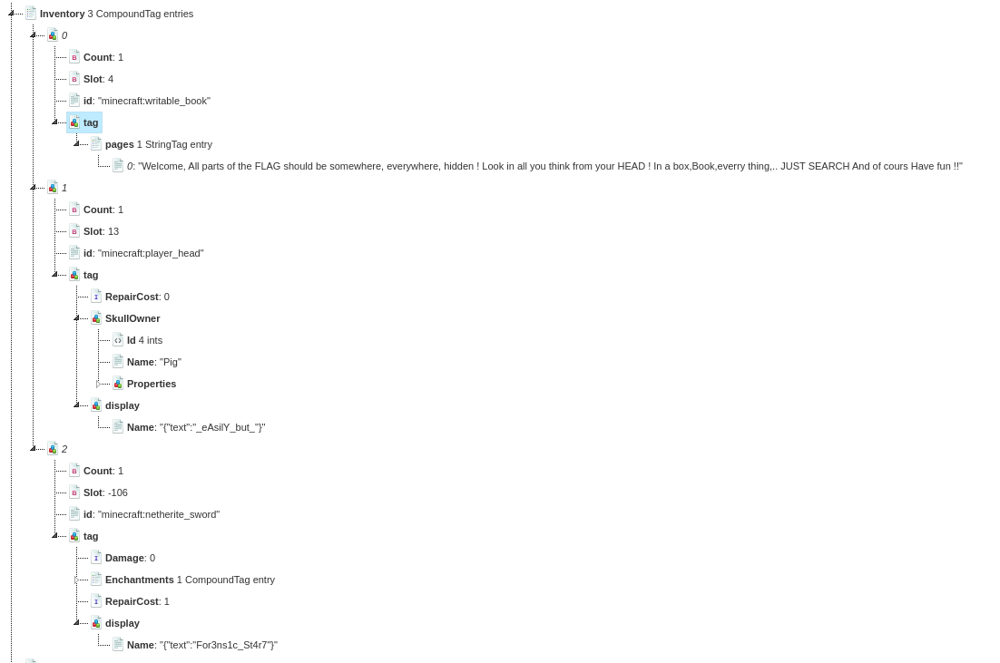

# Enoncé :
Un groupe de terroriste exfiltre des données via un jeu vidéo. 

Il doivent utiliser leur sauvegarde pour cela.


A partir de cette sauvegarde, trouvez les 4 parties du flag.

Il n'est pas important d'installer le jeu.

Auteur : Penthium2 (BZHack)

# Analyse

La sauvegarde viens du jeux minecraft.

La première chose facile a faire est d'utilisé un éditeur d'inventaire minecraft ( NBT ) , et il existe un site web en ligne : https://nbt.mcph.to/

## inventaire :



### un "livre disant : "
	
			Welcome,
		All parts of the  FLAG should be somewhere, everywhere, hidden !
		Look in all you think from your HEAD !
		In a box,Book,everry thing,.. JUST SEARCH
		And of cours Have fun !!

### une tete de "pig" avec comme nom :p1 

	For3sic_Start

### épée avec comme nom : p2

	_Easely_but_


## La suite..

Le challange se nomme headshot, dans l'inventaire du joueur nous avons une tete de cochon" ! le livre nous dit de chercher partout. 

Dans lé répertoire nous y trouvons un datapack compresser. après décompression on y trouve des fichiers interessant :

headShot/datapacks/AllMobHeads_V5.5+1.16/data/minecraft/loot_tables/entities avec des fichier json.

regardons le fichier pig.json :

headShot/datapacks/AllMobHeads_V5.5+1.16/data/minecraft/loot_tables/entities/pig.json :
```{
  "type": "minecraft:entity",
  "pools": [
    {
      "rolls": 1,
      "entries": [
        {
          "type": "minecraft:loot_table",
          "name": "vanilla:entities/pig"
        }
      ]
    },
    {
      "rolls": 1,
      "entries": [
        {
          "type": "item",
          "name": "minecraft:player_head",
          "weight": 1,
          "functions": [
            {
              "function": "set_nbt",
              "tag": "{SkullOwner:{Id:[I;-505298204,517097277,-1109246265,408114073],Name:'Pig',Properties:{textures:[{Value:'aHR0cHM6Ly93d3cueW91dHViZS5jb20vd2F0Y2g/dj1kUXc0dzlXZ1hjUQ='}]}}}"
            }
          ]
        }
      ],
      "conditions": [
        {
          "condition": "killed_by_player"
        },
        {
          "condition": "random_chance_with_looting",
          "chance": 0.001,
          "looting_multiplier": 0.01
        }
      ]
    }
  ]
}
```
et si on decode la base64 "aHR0cHM6Ly93d3cueW91dHViZS5jb20vd2F0Y2g/dj1kUXc0dzlXZ1hjUQ" on a : 

https://www.youtube.com/watch?v=dQw4w9WgXcQ

RICK ROLL ! certe mais donc le reste doit etre par ici.

voici la liste des fichiers modifiés et leur contenu : 


### headShot/datapacks/data/minecraft/loot_tables/entities/ee/974.json [TROLL] 

			https://soundcloud.com/mad-core/darktek-ta-geule
			base64 : aHR0cHM6Ly9zb3VuZGNsb3VkLmNvbS9tYWQtY29yZS9kYXJrdGVrLXRhLWdldWxlCg=


### headShot/datapacks/data/minecraft/loot_tables/entities/ee/venomHead : p3 : G0_Som3t1me_d33per

	headShot/datapacks/data/minecraft/loot_tables/entities/ee/venom.json 
			{"textures":{"SKIN":{"url":"http://textures.minecraft.net/texture/G0_Som3t1me_d33per"}}}
			base64 : eyJ0ZXh0dXJlcyI6eyJTS0lOIjp7InVybCI6Imh0dHA6Ly90ZXh0dXJlcy5taW5lY3JhZnQubmV0L3RleHR1cmUvRzBfU29tM3QxbWVfZDMzcGVyIn19fQo

### headShot/datapacks/data/minecraft/loot_tables/entities/creeperHead : p4 : _w1Th_tr0lls}
			{"textures":{"SKIN":{"url":_w1Th_tr0lls}
			base64 : e3RleHR1cmVzOntTS0lOOnt1cmw6X3cxVGhfdHIwbGxzfQo=


# FLAG :
FLAG{For3sic_Start_Easely_but_G0_Som3t1me_d33per_w1Th_tr0lls}
